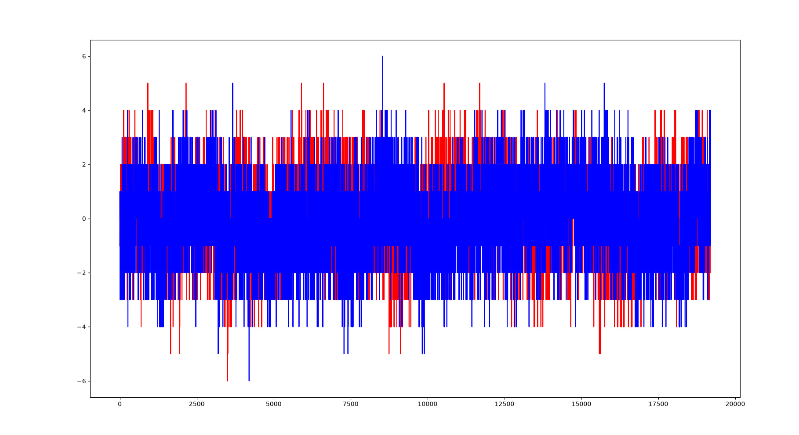

# Отчёт по лабораторной работе

**Тема:** Adalm Pluto SDR & Timestamp

## Цель работы
Ознакомиться с архитектурой Adalm Pluto SDR, работой с SoapySDR и использованием временных меток (timestamp) для синхронной передачи/приёма IQ-сэмплов. Реализовать приём и передачу данных с записью RX-буфера в файл и визуализацией.

## Краткое содержание
Adalm Pluto состоит из аналогового приёмопередатчика AD9363 и SoC Xilinx Zynq-7000. Передача данных с хостом идёт по USB 2.0. Для синхронизации RX/TX используются временные метки, получаемые с FPGA (модифицированный драйвер SoapyPlutoSDR с поддержкой timestamp).

### Основные этапы
1. Установка SoapySDR, libiio, libad9361, SoapyPlutoSDR (ветка sdr_gadget_timestamping).
2. Написание C++ программы с использованием SoapySDR API:
   - Инициализация устройства (driver=plutosdr, uri=usb:, timestamp_every=1920)
   - Настройка Sample Rate = 1 МГц, Frequency = 800 МГц
   - Gain RX = 30 дБ, TX = −40 дБ
   - Создание RX/TX потоков (SOAPY_SDR_CS16)
3. В цикле:
   - Чтение RX-буфера + получение timestamp
   - Запись сэмплов в файл `txdata.pcm`
   - На 3-й итерации — передача TX-буфера с timestamp (задержка +4 мс)
4. Визуализация принятых I/Q сэмплов с помощью Python-скрипта.

### Ключевые параметры программы
| Параметр | Значение |
|----------|----------|
| Sample Rate | 1 МГц |
| Carrier Frequency | 800 МГц |
| Формат сэмплов | CS16 (int16 I/Q) |
| MTU | определяется устройством |
| Итераций | 10 |
| TX отправка | только на 3-й итерации |

## Результаты

Принятые I/Q сэмплы (синий — Real, красный — Imag) записаны в `txdata.pcm` и отображены:

На графике виден принятый сигнал (уровень примерно ±2…±4 с выбросами). Timestamp позволяют контролировать разницу во времени между буферами и синхронизировать TX относительно RX.

## Вывод
Успешно реализована работа с Adalm Pluto через SoapySDR с поддержкой временных меток. Получены и визуализированы IQ-сэмплы. Timestamp обеспечивают возможность точной синхронизации передачи и приёма, что критично при ограничении пропускной способности USB 2.0.
