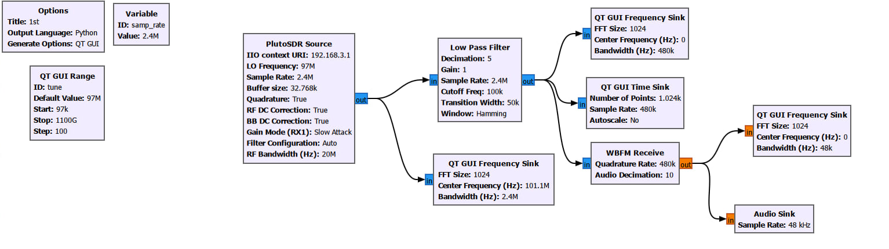
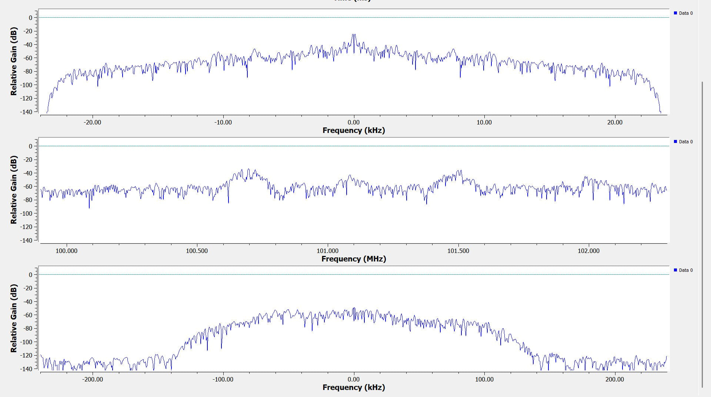

# Отчёт по лабораторной работе

**Тема:** GNU Radio. Построение радио-приёмника

## Цель работы
Ознакомиться с инструментом GNU Radio Companion и собрать простой FM-радиоприёмник на базе SDR (Adalm-Pluto) без написания кода, используя готовые блоки.

## Краткое содержание
GNU Radio — открытый инструмент для программно-определяемого радио (SDR). Позволяет собирать радиоустройства из «строительных блоков» через графический интерфейс GNU Radio Companion.

### Необходимое оборудование и ПО
- Устройство SDR (Adalm-Pluto)
- Наушники / динамики
- GNU Radio Companion

### Основные блоки схемы
| Блок | Назначение | Ключевые параметры |
|------|------------|--------------------|
| **PlutoSDR Source** | Приём сигнала с SDR | LO Frequency: 97 МГц, Sample Rate: 2.4 МГц |
| **Low Pass Filter** | Фильтрация ненужных частот | Cutoff Freq: 100 кГц, Decimation: 5 |
| **WBFM Receive** | Демодуляция FM-сигнала | Quadrature Rate: 480 кГц, Audio Decimation: 10 |
| **Audio Sink** | Вывод звука | Sample Rate: 48 кГц |
| **QT GUI Frequency Sink** | Просмотр спектра | — |
| **QT GUI Time Sink** | Просмотр сигнала во времени | — |
| **QT GUI Range** | Управление частотой настройки | ID: tune, Default: 97 МГц |

## Итоговая схема

## Визуализация принятого сигнала

## Вывод
В ходе работы освоена работа с GNU Radio Companion. Собрана и настроена схема FM-радиоприёмника. Получен практический навык цифровой обработки сигнала и работы с блоками SDR.
