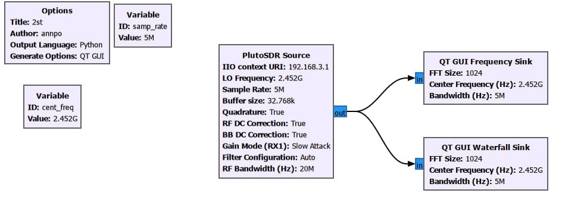
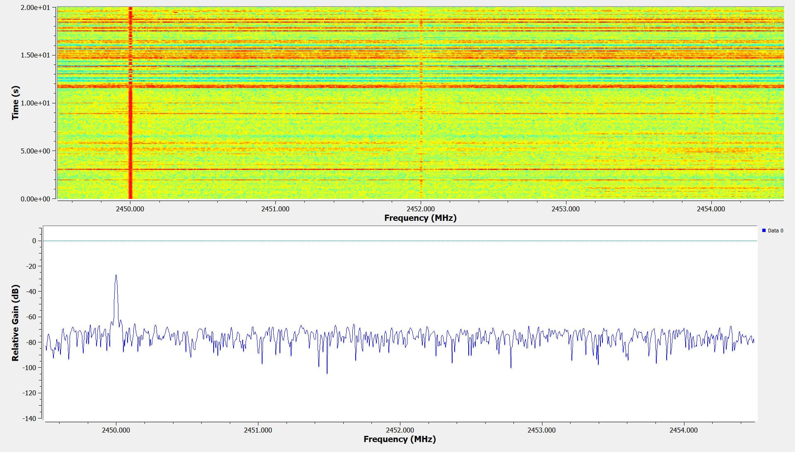

# Отчёт по лабораторной работе

**Тема:** Приём Wi-Fi сигнала с помощью GNU Radio и Adalm-Pluto SDR

## Цель работы
Ознакомиться с приёмом сигналов в диапазоне 2.4 ГГц (Wi-Fi) с использованием GNU Radio Companion и устройства Adalm-Pluto. Построить схему спектрального анализа и визуализации сигнала.

## Краткое содержание
В данной работе настроен приёмник для наблюдения спектра Wi-Fi (ISM-диапазон 2.4 ГГц). Используется блок PlutoSDR Source, настроенный на частоту около 2.452 ГГц. Сигнал визуализируется с помощью QT GUI Frequency Sink и QT GUI Waterfall Sink.

### Необходимое оборудование и ПО
- Устройство SDR (Adalm-Pluto)
- GNU Radio Companion

### Основные блоки схемы
| Блок | Назначение | Ключевые параметры |
|------|------------|--------------------|
| **PlutoSDR Source** | Приём сигнала с SDR | LO Frequency: 2.452 ГГц, Sample Rate: 5 МГц, IIO context URI: 192.168.3.1 |
| **Variable (samp_rate)** | Частота дискретизации | 5 МГц |
| **Variable (cent_freq)** | Центральная частота | 2.452 ГГц |
| **QT GUI Frequency Sink** | Отображение спектра | FFT Size: 1024, Bandwidth: 5 МГц |
| **QT GUI Waterfall Sink** | Водопадная диаграмма | FFT Size: 1024, Bandwidth: 5 МГц |

## Схема приёмника

## Результаты наблюдения

На водопадной диаграмме и спектре виден сигнал около **2452 МГц**, что соответствует активному Wi-Fi каналу в диапазоне 2.4 ГГц.

## Вывод
Успешно настроена схема приёма и визуализации Wi-Fi сигнала в диапазоне 2.4 ГГц. С помощью Adalm-Pluto и GNU Radio получены спектр и водопадная диаграмма, на которых наблюдается характерный пик Wi-Fi-сигнала.
